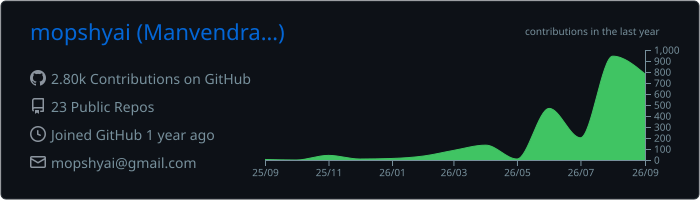
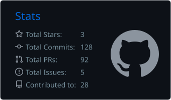
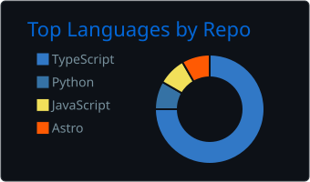
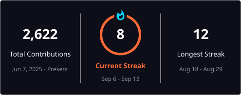

<!-- Profile README for github.com/mopshyai -->

## Building AI products that ship

I'm **Manvendra Kumar**, a Product Manager focused on **AI + operations platforms**. I work end-to-end — discovery, product strategy, PRDs, architecture tradeoffs, delivery, experimentation, and operating metrics — and I stay close enough to the implementation to understand what the system can actually do.

- **Product:** 0→1 platforms, roadmap ownership, discovery, JTBD, RICE, PR/FAQ, OKRs, experimentation
- **Applied AI:** LLM workflows, agentic systems, RAG, prompt/eval loops, human-in-the-loop design
- **Delivery:** APIs, SQL, TypeScript/React, Python, Supabase, n8n, GitHub, Jira/Linear

### What I'm focused on now

| | Focus | What I'm building / leading |
|---|---|---|
| **Product** | **Product Manager — Discovery Analytics** | AI-enabled product and operations platforms from discovery through delivery |
| **Healthcare AI** | **Founder — CareBow** | Family healthcare companion combining care services, safety workflows, and AI health guidance |
| **Product OS** | **ProductJarvis** | AI product operating system for PRDs, ticket generation, decision memory, digests, and intent routing |
| **Agentic Growth** | **Mopshy GrowthOS** | Multi-agent growth system with shared memory, measurable runs, and explicit human approval gates |

---

## Selected builds

<table>
<tr>
<td width="50%" valign="top">

### [ProductJarvis](https://github.com/mopshyai/productjarvis)
**AI Product Operating System**

Natural-language command routing, structured PRD generation, Jira/Linear ticket previews, decision memory with citations, daily digests, and product-health workflows.

`React` `Vite` `Supabase` `LLM Routing` `Prompt Engine`

[Live prototype](https://productjarvis.vercel.app) · [Repository](https://github.com/mopshyai/productjarvis)

</td>
<td width="50%" valign="top">

### [CareBow](https://github.com/mopshyai/carebowapp)
**AI-Powered Family Healthcare Companion**

React Native healthcare app connecting families with caregivers and medical services, plus AI symptom guidance, family health profiles, SOS workflows, and service booking.

`React Native` `TypeScript` `Next.js` `Prisma` `AI Triage`

[Repository](https://github.com/mopshyai/carebowapp)

</td>
</tr>
<tr>
<td width="50%" valign="top">

### [Mopshy GrowthOS](https://github.com/mopshyai/mopshy-growthos)
**Agentic Growth Operating System**

A coordinated network of specialized AI agents for SEO, content, reputation, CRO, lead intent, and growth direction — with shared memory, evidence-first execution, and approval gates.

`n8n` `Supabase/Postgres` `OpenAI` `GA4` `HubSpot`

[Repository](https://github.com/mopshyai/mopshy-growthos)

</td>
<td width="50%" valign="top">

### [OnliGrow](https://github.com/mopshyai/onligrow)
**AI Education Platform**

Product and web platform supporting OnliGrow's mission to bring AI education to schools in India, with analytics, lead capture, validation, and conversion-focused product flows.

`Next.js` `TypeScript` `Tailwind` `Framer Motion` `Analytics`

[Repository](https://github.com/mopshyai/onligrow)

</td>
</tr>
</table>

---

## Selected impact

| **500+** | **40%** | **30%** | **20+** | **10K+** |
|:---:|:---:|:---:|:---:|:---:|
| Daily claims supported | Ops reduction | First-touch resolution lift | SMB clients | Monthly AI interactions |

---

## Product + AI toolkit

**Product systems:** Discovery · PRDs · Roadmaps · RICE · JTBD · PR/FAQ · OKRs · A/B testing · Product analytics · Agile/Scrum

**AI systems:** Agentic workflows · RAG · Prompt engineering · Evals · Structured outputs · Tool use · HITL · LLM observability

---

## GitHub activity

<!-- These cards are generated into this repository by .github/workflows/profile-stats.yml. -->

Generated automatically with GitHub Actions so the profile is not dependent on fragile public stats-card endpoints.

---

## Writing

I write about **agentic AI, human-in-the-loop architecture, product discovery, product operations, and building AI-native platforms**.

---

### Build something useful. Measure whether it worked. Improve the system.

[Portfolio](https://manvendrakumar.com) · [LinkedIn](https://linkedin.com/in/manvendrax7) · [Book a call](https://cal.com/manvendrakumar/30min) · [Email](mailto:mkworkingx7@gmail.com)

